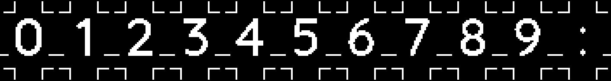

# hl950-font

This repository contains an updated font for
mode 5 of the Tag Heuer HL950 Modulo display
built by Digiwest.

Based on
[Quicksand Medium](https://fonts.google.com/specimen/Quicksand),
the font aims to improve readability at long distance
and better utilise screen space for typical layouts
like eplased time, laps, distance and and gap:

## Usage

Scripts to read the firmware, remap the digits, patch the 
firmware and write it back to the device are provided in the
[scripts](scripts/) folder.

To use supplied firmware (version 1.3.03), use make:

	$ make devwrite

Otherwise, extract the firmware to program/hl950.hex, and
check the offsets in fontpatch.py carefully:

	$ make devread

	FONTOFT = 0x9984
	LOGOOFT = 0x3345c

## Font Map

   - [func_32x15.xcf](font/func_32x15.xcf) 3040x48 GIMP XCF image
   - [func_32x15.pbm](font/func_32x15.pbm) 3040x48 P4 PBM

Mode 5 on the display is a 2 column by one row layout
per module. Digits are approximately 22 pixels tall and 15
pixels wide, with a baseline 8 pixels from the bottom of
module. Alphabetic and special characters have a reduced height
of about 17 pixels and a descent of 5 from the baseline.

Each glyph is packed into 15 columns of 4 bytes,
LSB is toward top of display and bytes are ordered
top to bottom. The first byte indicates
xadvance and is always 16 in this case:

